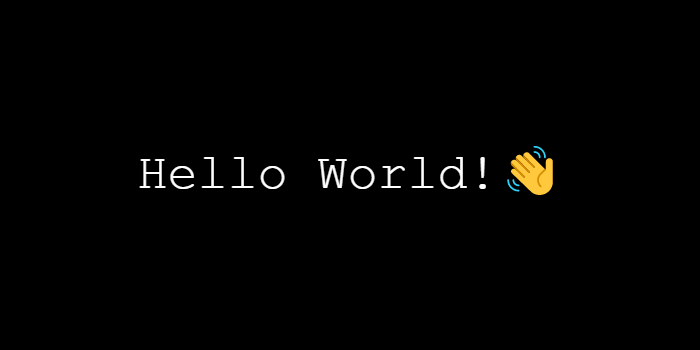
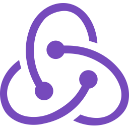
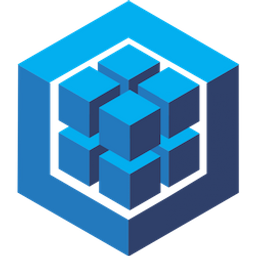

 

<h2 align='center'><b>💻FULL STACK DEVELOPER💻</b></h2>

 

## Lenguajes

 

    
    
    

## Frontend

 

    
    
    
    

## Backend

 

    
    
    
    
    

 

# Ultimo Proyecto

### Landing

 

### Home

    
    
    

 

### Agregar recetas

 

### Recetas creadas

 

# Te interesó mi perfil? Contactame📞

`LinkedIn:` https://www.linkedin.com/in/lucasfernandez-dev/

 

`Mail:` lucasfer9912@gmail.com

# Estadisticas

